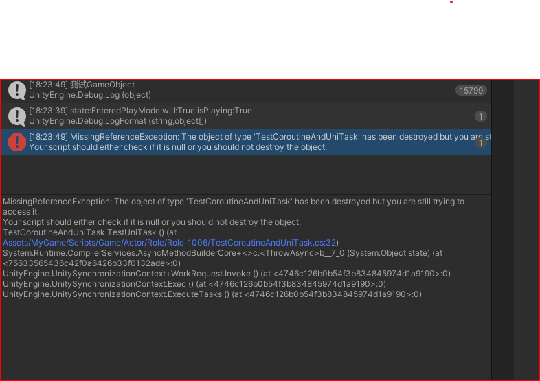

## 协程(Coroutine)和UniTask
依赖生命周期的脚本中尽量使用coroutine,因为携程逻辑开启和结束和mono脚本生命周期
绑定,UniTask的异步是全局运行即使脚本被销毁依然执行
 
 ### 测试代码
 ```
   public void Start()
  {
      // StartCoroutine(TestRoutine());
      TestUniTask();
  }
  private void Update()
  {
      if (Input.GetKeyDown(KeyCode.Space))
          Destroy(this.gameObject);

  }
  IEnumerator TestRoutine()
  {
      while (true)
      {
          yield return null;
          Debug.Log("测试" + gameObject.name);
      }
  }
  async void TestUniTask()
  {
      while (true)
      {
          await UniTask.DelayFrame(1);
          Debug.Log("测试" + gameObject.name);
      }
  }
 ```
### 结果
使用unitask函数的输出
