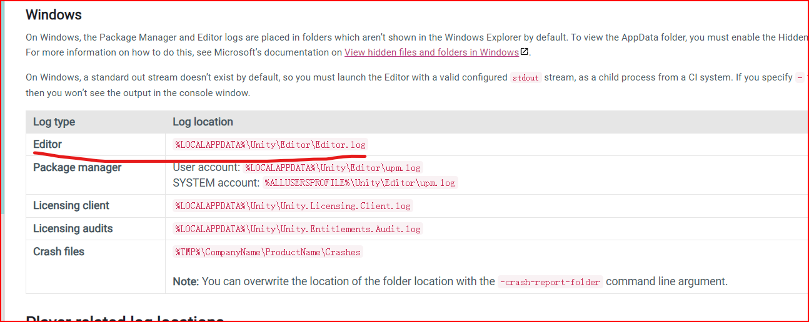
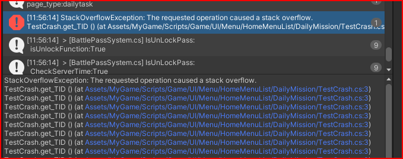

# 问题
修改维护功能过程中突然发现游戏跑着在Unity编辑器内闪退了

# 解决
## 查找日志
先看官方文档上不同unity版本日志文件存放存放地址,**不同版本还是有一点差异的**

[21.3版本地址](https://docs.unity3d.com/2021.3/Documentation/Manual/LogFiles.html)


## 日志信息

```
StackOverflowException: The requested operation caused a stack overflow.
  at DailyMissionPopup.get_FixedadMissionUI () [0x00000] in E:\NeverSoft\Assets\MyGame\Scripts\Game\UI\Menu\HomeMenuList\DailyMission\DailyMissionPopup.cs:19 
  at DailyMissionPopup.get_FixedadMissionUI () [0x00000] in E:\NeverSoft\Assets\MyGame\Scripts\Game\UI\Menu\HomeMenuList\DailyMission\DailyMissionPopup.cs:19 
  at DailyMissionPopup.get_FixedadMissionUI () [0x00000] in E:\NeverSoft\Assets\MyGame\Scripts\Game\UI\Menu\HomeMenuList\DailyMission\DailyMissionPopup.cs:19 
```
可以看出是堆栈溢出日常,这个属性**FixedadMission**循环get出不来了

## 处理问题代码

```  
  [SerializeField] FixedadMissionUI fixedadMissionUI;
  //public FixedadMissionUI FixedadMissionUI => FixedadMissionUI;
    public FixedadMissionUI FixedadMissionUI => fixedadMissionUI;
```
#思考

这样直接导致Unity编辑器闪退了,查日志也是比较费劲的,试想是不是与unity object脚本有关

## 验证

```
public class TestCrash
{
    public int TID => TID;
}
```
## 运行结果

